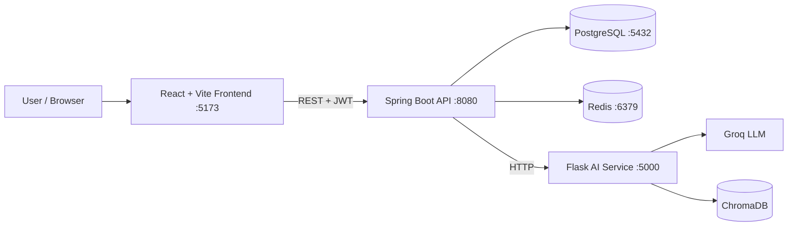
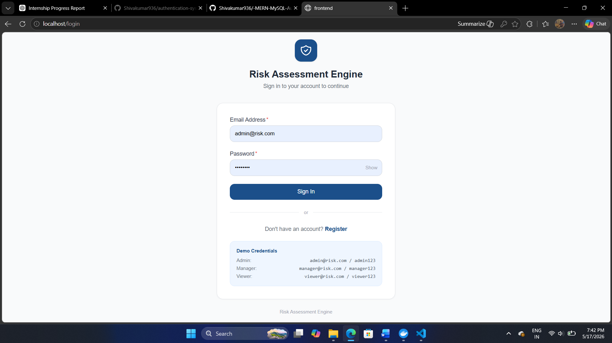
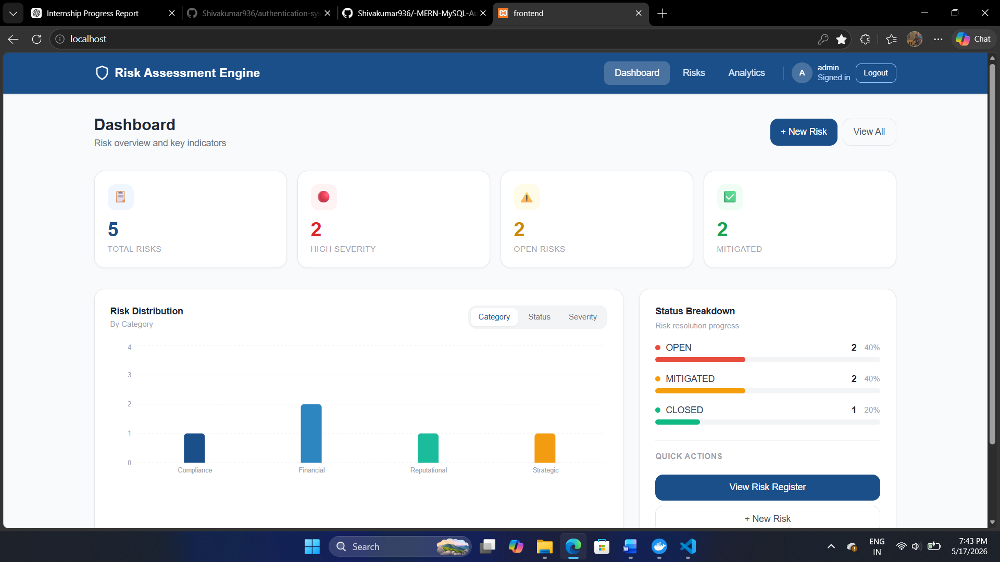
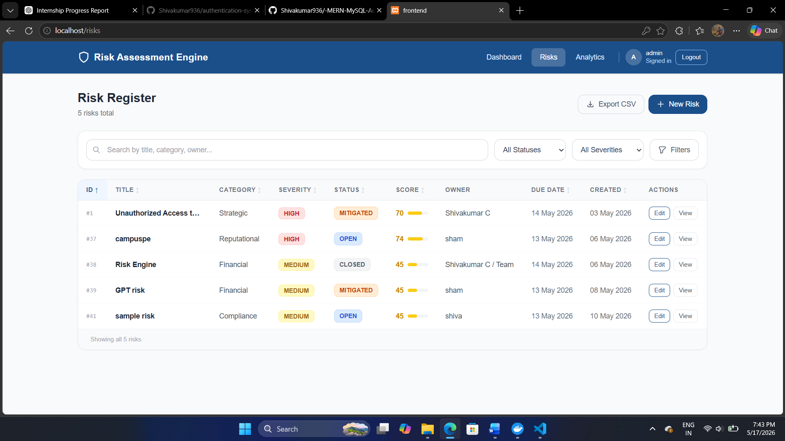
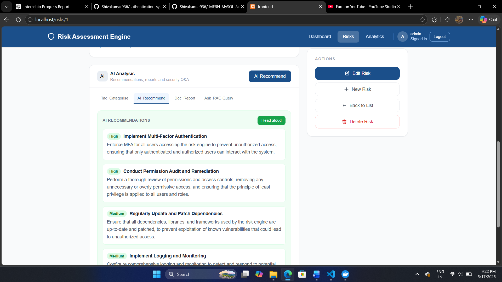
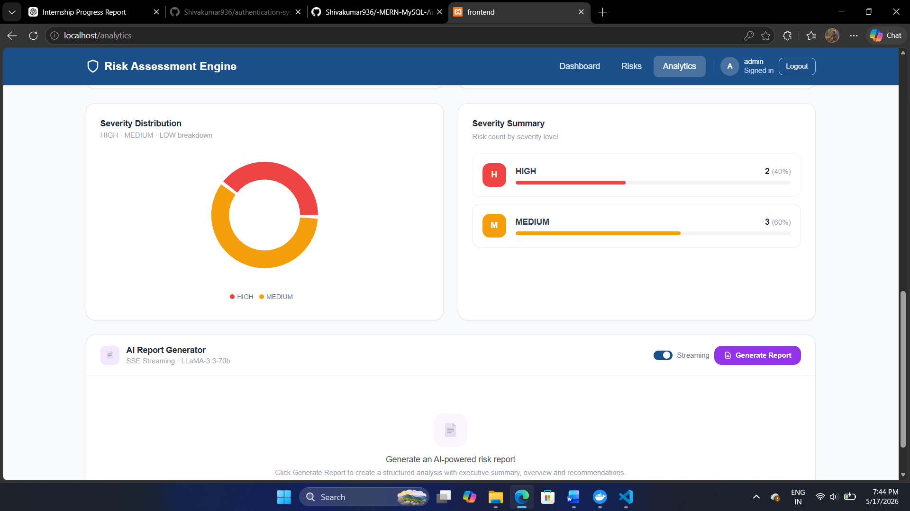

 Risk Assessment Engine
 


 
> Enterprise-grade Full Stack Risk Management System with AI-powered analysis, real-time analytics, and secure role-based access.
 
---
 
## 📖 Overview
 
The **Risk Assessment Engine** is a collaborative capstone project developed by an **8-member engineering team** during a **20-day sprint**. It helps organizations identify, assess, prioritize, and manage operational risks using modern web technologies and Generative AI. The official project specification defines the team size, sprint timeline, ports, and technology stack.
 
---
 
## ✨ Key Features
 
| Feature | Description |
|---|---|
| **Secure Authentication** | JWT + Role-Based Access Control |
| **AI Risk Analysis** | Descriptions, categorization & recommendations |
| **Analytics Dashboard** | KPIs, charts & business insights |
| **Audit & Reporting** | CSV export, logs & AI reports |
 
---
 
## 👥 Team
 
This project was completed as an 8-member collaborative capstone.
 
| Member | Responsibility |
|---|---|
| Shivakumar C | Java Developer 3 · React Frontend Lead |
| Anushree D | Java Developer 1 |
| Prathibha M S | Java Developer 2 |
| C M Ayesha Siddiqa | AI Developer 1 |
| Rithvik Allada | AI Developer 2 |
| Sanjana D | AI Developer 3 |
| Ashakirana V | Security Reviewer |
| Team Member | Project Coordination |
 
---
 
## 🛠 Tech Stack
 
The project follows the exact capstone technology stack.
 
| Layer | Technologies |
|---|---|
| **Frontend** | React 18 · Vite · Tailwind CSS · Axios · Recharts |
| **Backend** | Java 17 · Spring Boot 3 · Spring Security · JWT |
| **AI Service** | Python 3.11 · Flask · Groq · ChromaDB |
| **Infrastructure** | PostgreSQL · Redis · Docker Compose |
 
---
 
## 🏗 System Architecture
 

 
---
 
## 📁 Project Structure
 
The repository follows the official capstone folder structure.
 
```text
risk-assessment-engine/
│
├── backend/                 # Spring Boot REST API
│   ├── controller/
│   ├── service/
│   ├── repository/
│   ├── entity/
│   ├── dto/
│   └── config/
│
├── frontend/                # React + Vite UI
│   ├── components/
│   ├── pages/
│   ├── services/
│   └── App.jsx
│
├── ai-service/              # Flask AI Microservice
│   ├── routes/
│   ├── services/
│   ├── prompts/
│   └── app.py
│
├── docker-compose.yml
├── .env.example
└── README.md
```
 
---
 
## 🚀 Getting Started
 
### Prerequisites
 
Install these before running the project:
 
- Docker Desktop (Latest)
- Git
- 8 GB RAM minimum
### 1. Clone the Repository
 
```bash
git clone https://github.com/your-org/risk-assessment-engine.git
cd risk-assessment-engine
```
 
### 2. Create Environment File
 
Create a `.env` file in the root directory.
 
```env
# Database
POSTGRES_DB=riskdb
POSTGRES_USER=postgres
POSTGRES_PASSWORD=postgres
 
# JWT
JWT_SECRET=your_super_secret_key
 
# AI
GROQ_API_KEY=your_groq_api_key
 
# Redis
REDIS_HOST=redis
REDIS_PORT=6379
```
 
> ⚠️ **Never commit `.env` to GitHub.**
 
---
 
## 🐳 Run with Docker
 
**Build & start all services**
 
```bash
docker compose up --build
```
 
**Run in background**
 
```bash
docker compose up -d
```
 
**Stop containers**
 
```bash
docker compose down
```
 
**Reset everything**
 
```bash
docker compose down -v
docker compose up --build
```
 
The capstone specification requires all services to run together using Docker Compose.
 
---
 
## 🌐 Application URLs
 
| Service | URL |
|---|---|
| 🎨 Frontend | http://localhost:5173 |
| ⚙️ Spring Boot API | http://localhost:8080 |
| 📚 Swagger UI | http://localhost:8080/swagger-ui.html |
| 🤖 AI Health | http://localhost:5000/health |
| 🐘 PostgreSQL | `localhost:5432` |
| 🔴 Redis | `localhost:6379` |
 
---
 
## 📊 Core Modules
 
| Module | Capabilities |
|---|---|
| **Risk Management** | Create, update, delete, search, filter, pagination |
| **AI Intelligence** | Describe, recommend, categorize, generate reports |
| **Analytics** | KPI dashboard, bar charts, pie charts, trends |
| **Security** | JWT, RBAC, audit logs, rate limiting |
 
---
 
## 🔌 REST API
 
### Authentication
 
| Method | Endpoint |
|---|---|
| POST | `/auth/register` |
| POST | `/auth/login` |
| POST | `/auth/refresh` |
 
### Risk Records
 
| Method | Endpoint |
|---|---|
| GET | `/api/risks` |
| GET | `/api/risks/{id}` |
| POST | `/api/risks` |
| PUT | `/api/risks/{id}` |
| DELETE | `/api/risks/{id}` |
 
### AI Service
 
| Method | Endpoint |
|---|---|
| POST | `/describe` |
| POST | `/recommend` |
| POST | `/categorise` |
| POST | `/generate-report` |
| POST | `/query` |
| GET | `/health` |
 
---
 
## 🔒 Security Highlights
 
The project includes security measures defined during the capstone sprint.
 
- JWT Authentication
- Role-Based Authorization (**ADMIN · MANAGER · VIEWER**)
- BCrypt Password Encryption
- Input Sanitization
- Rate Limiting
- Audit Logging
- OWASP Security Testing
---
 
## 🧪 Testing
 
**Backend**
 
```bash
cd backend
mvn test
```
 
**Frontend**
 
```bash
cd frontend
npm test
```
 
**AI Service**
 
```bash
cd ai-service
pytest
```
 
---
 
## 📸 Screenshots

### Login


### Dashboard


### Risk List


### AI Panel


### Analytics

---
 
## 🤝 Git Workflow
 
The team follows daily commits throughout the sprint.
 
```bash
git add .
git commit -m "Day 12 - Implemented Docker integration"
git push origin main
```
 
---
 
## 🎯 Demo Checklist
 
Before presentation, ensure:
 
- [ ] Docker Compose starts successfully
- [ ] Frontend & Backend connected
- [ ] AI Service responding
- [ ] Swagger documentation available
- [ ] Seeded demo data loaded
- [ ] Analytics dashboard working
- [ ] Security features verified
---
 
## 📄 License
 
Capstone Team Project · Developed for internship, learning, and portfolio purposes.
 
---
 
<p align="center"><sub>Team of 8 Members · Spring Boot · React · Flask · Docker</sub></p>
